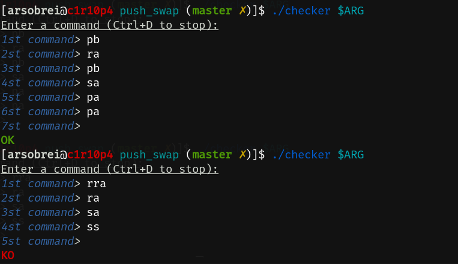

<div align="center"><h1>Push Swap [125 / 100]</h1></div>

<div align="center">
   <a href="https://github.com/ArthurSobreira/42_push_swap" target="_blank">
      
   </a>
</div>

## Summary

> <i>The seventh project in the 42sp fundamentals track, <strong>Push Swap</strong>, is based on the creation of a program</i>
> <i>that receives as parameter a stack (ordered or not) and sorts it by ascending order, using only a set of specific movements</i>
> <i>(SA, SB, SS, PA, PB, RA, RB, RR, RRA, RRB, RRR). The main objective of this project is to introduce the concept of complexity and sorting algorithms.</i>

<br>

## Run the Program

* Make sure you clone the repository with the following command:

```bash
$> git clone git@github.com:ArthurSobreira/42_push_swap.git
```

* Once cloned, to compile the program, use the following commands:

```bash
$> make / make bonus
```

<br>

## Mandatory Part

* To run the mandatory part of the program, you just need to have access to a stack, and pass it to the program as an argument:

```bash
$> ARG="0 8 2 7 3"; ./push_swap $ARG
```

* The program must return a list of instructions (each followed by a <code>\n</code>) that will properly sort the stack in ascending order, something like:

```bash
pb
ra
pb
sa
pa
pa
```

<br>

## Bonus Part

* The bonus part of the project is creating your own checker for push_swap, which will receive as a parameter a stack, and then will wait for the instruction by STDIN.
If, after executing these instructions on the stack, it is properly ordered, the checker must display <code>OK</code>. In any other case, it must display <code>KO</code>:

<div align="center">
   
</div>
